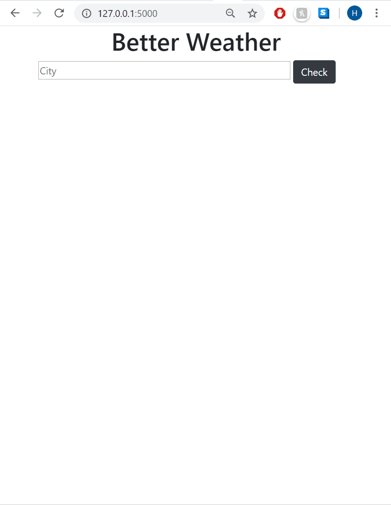

# Better Weather : Final Project CS50W

CS50W: Web Programming with Python and JavaScript

"Better Weather" is a weather query web application using python, flask, javascript, graph.js and jquery.

On this web app, users can query weather for a particular city and get in response: a weather icon, 
temperature, weather summary and 3 graph showing hourly data: wind, precipitation probability and temperature.



## Install


Download project and navigate to the project root on the command prompt

If you are on Windows:
```
set FLASK_APP=application.py
flask run
```
If you are using a Mac:
```
export FLASK_APP=application.py
flask run
```
Copy paste the URL showing on the terminal to your web browser:

`* Running on http://127.0.0.1:5000/`

## App Functionalities
1. Display cities similar to user input
Once a user starts typing, a list of cities that have a name starting with the same characters typed
will be displayed underneath. From there, he/she can select an option or directly click on the 
"check the weather" button.

2. Retrieve city coordinates
If the button is clicked while an option is selected, then a query to the geolocalisation database for 
the exact city selected will be initiated to retrieve latitude and longitude.
If no option is selected, then the server will check if the user input can be matched with a line of 
the database. If not, the first similar database entry will be used to retrieve latitude and longitude.

3. Retrieve city weather info
With the city coordinates, an API call to darksky will be initiated. Then the response will be formated 
in JSON with the proper information.

4. Display results
The DOM will then be updated based on the API response with city Name, Country, Temperature, Summary,
weather icon and a graph with temperatures per hour.
The color of this icon will be changed based on the type of weather (for example: yellow for day sun, 
black for night).

5. Change Graph
Based on the button pressed (Temperature, Wind, Precipitation), the information displayed on the graph
will be updated. As the API will only display a UNIX time (which can be translated to a UTC time),
a query to a TimeZone database will be initiated to apply the proper offset to the UTC time.
The graph is only showing the data for every 3rd hour for better readability.

### How I used JavaScript to improve the User Experience: 

#### Suggested queries:

When a user is looking for the weather of a particular city, a list of cities that starts with the same characters will automatically appear under the input field based on the user input and will update at each key stroke.

To perform this action, I used jquery: 

- At each key stroke event, a GET request will be generated to the `/city` endpoint with the input value as query parameter.
- If a user types: "pari" on the input field, it will generate an API call `http://127.0.0.1:5000/city?q=pari` that will return a list of cities starting with "pari"
```
["Parintins, Brazil","Paris, France","Paris, United States","Paris, United States","Paris, United States","Paris, United States"]
```
- The data received by this API call will then be added to the DOM on a select menu.


Check out my youtube video to learn more about this project:
https://www.youtube.com/watch?v=612GhSAXi4s&t=4s
 
